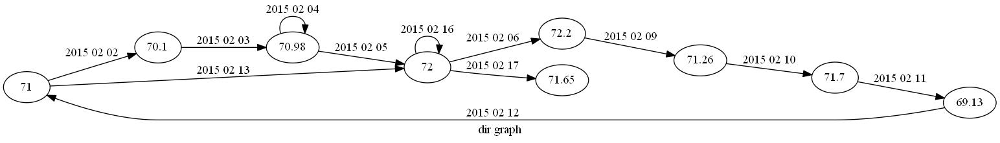
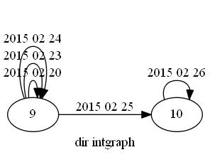
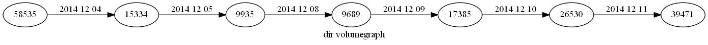
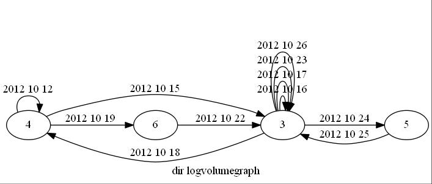
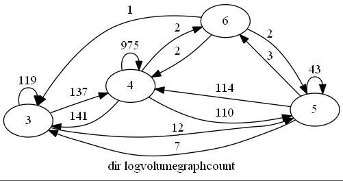

# StooqTimeSeriesConverter-Data
Result of running StooqTimeSeriesConverter

You can find project  [StooqTimeSeriesConverter under this link](https://github.com/arekbee/StooqTimeSeriesConverter).

